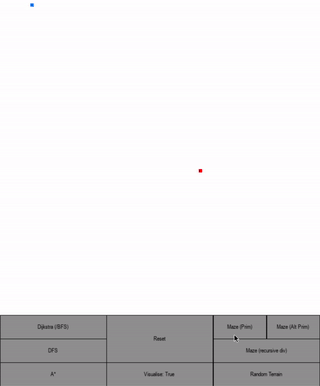
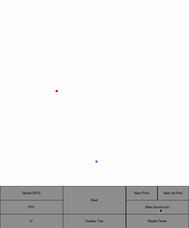
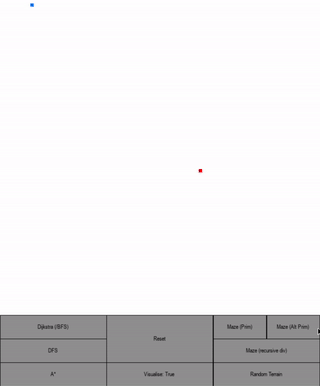
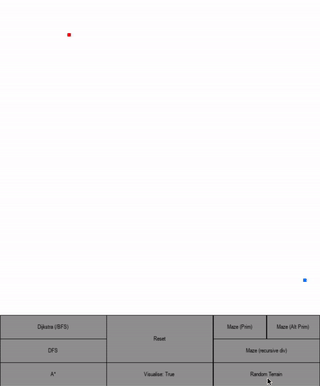
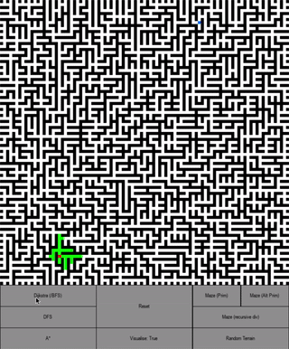
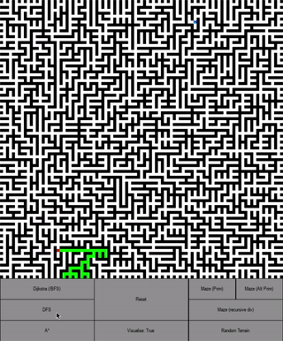
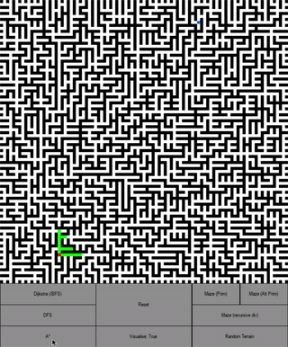

# Pygame Pathfinder

Visualise maze generation and pathfinding algorithms with Pygame.

## Installation

Clone this repo:

```bash
git clone https://github.com/ChrisKneller/pygame-pathfinder.git
```

Navigate to the appropriate folder:

```bash
cd pygame-pathfinder
```

## Usage

```bash
python grid.py
```

### Buttons

Maze/terrain generation buttons are on the right.

Some examples:

 




Pathfinding buttons are on the left.

Some examples

Dijkstra's algorithm (equivalent to BFS in this case)
 

Depth first search (DFS)
 

A* algorithm


The visualise button is a toggle.

### Grid interaction

Left click to create a wall or move the start and end points.

Hold control and left click to create a sticky mud patch (which reduces movement speed to 1/3).

After a pathfinding algorithm has been run you can drag the start/end points around and see the visualisation update instantly for the new path.

## Contributing
Pull requests are welcome. For major changes, please open an issue first to discuss what you would like to change.

## License
[GPL-3.0](https://github.com/ChrisKneller/pygame-pathfinder/blob/master/LICENSE)